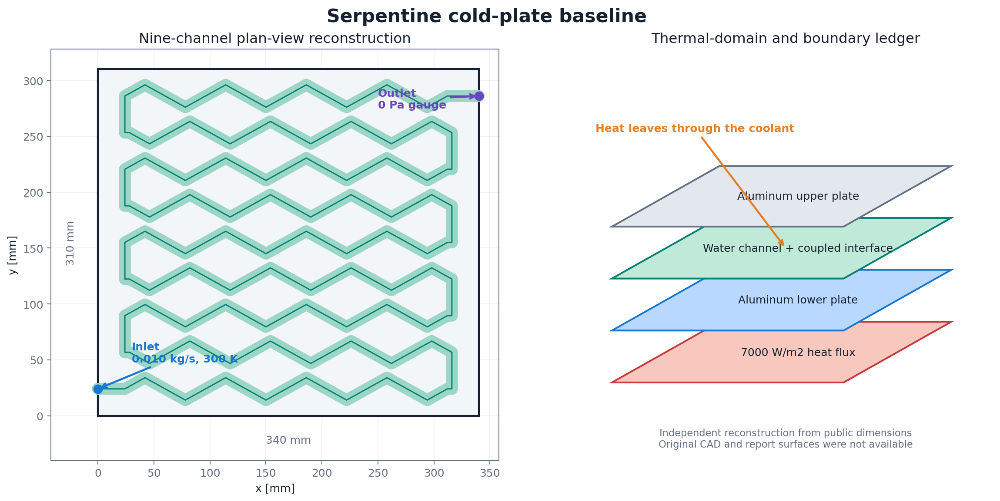
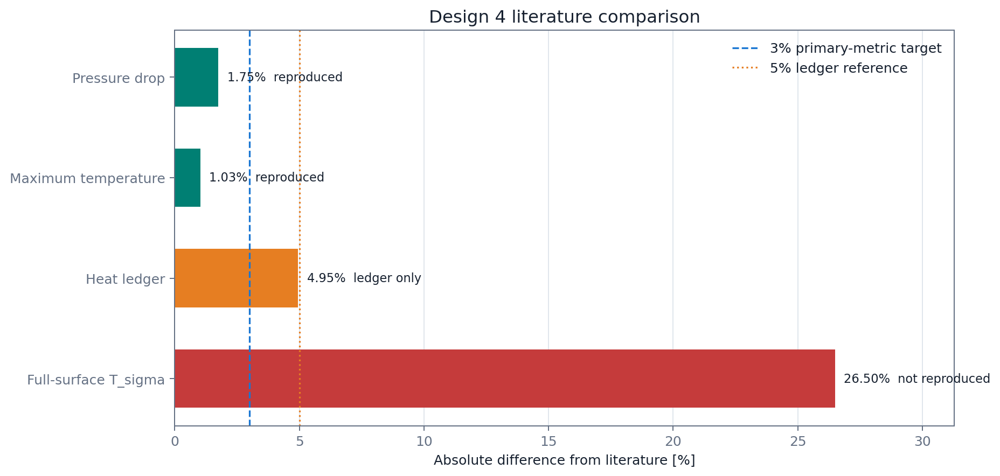
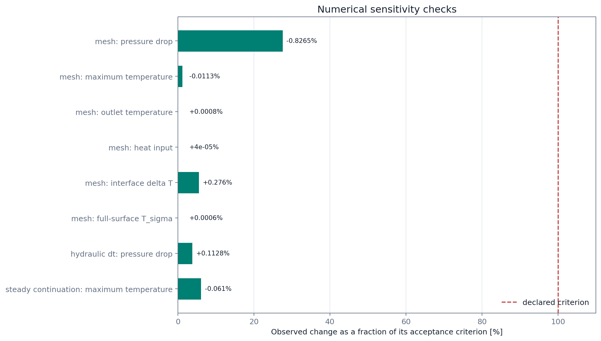
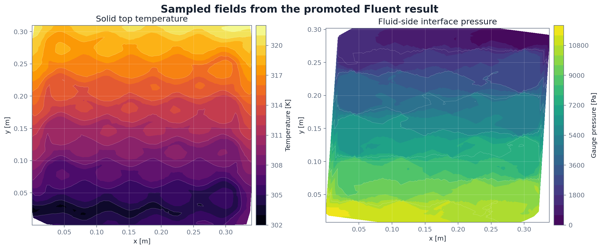

# Serpentine Cold-Plate CFD Reproduction

A compact, cross-solver reconstruction of the nine-channel battery cold plate
reported by Jayarajan and Azimov (2023). The published model was built in
STAR-CCM+; this repository documents an independent ANSYS Fluent
reconstruction, its numerical checks, and the parts of the benchmark that
remain uncertain.



## Why this case matters

Liquid cold plates are designed around a familiar conflict: more channel
length and stronger flow redistribution can improve heat removal, but they also
increase pumping power. A useful simulation therefore has to predict both the
thermal limit and the hydraulic penalty.

This project focuses on one operating point from the paper's six-design family:
Design 4, a nine-channel zig-zag serpentine plate. The objective was not to copy
an unavailable native model. It was to rebuild the public geometry and
operating protocol, reproduce the reported pressure drop and maximum
temperature, and make every comparison traceable.

## Baseline model

| Item | Value |
|---|---:|
| Cold-plate footprint | 340 mm x 310 mm |
| Plate thickness | 5 mm |
| Channel width / depth | 12 mm / 2 mm |
| Channel count | 9 |
| Zig-zag amplitude / pitch | 10 mm / 36 mm |
| Coolant mass flow | 0.010 kg/s |
| Coolant inlet temperature | 300 K |
| Applied bottom heat flux | 7000 W/m2 |
| Coolant model | Laminar water, constant properties |
| Thermal solve | Steady conjugate heat transfer |
| Hydraulic audit | First-order transient pressure-drop solve |

The fluid-solid interface is coupled. The outlet is fixed at zero gauge
pressure, and the non-heated exterior walls are adiabatic in the reconstructed
baseline. Full setup details are in [docs/methodology.md](docs/methodology.md).

## Main result

| Quantity | Literature | Fluent | Difference | Assessment |
|---|---:|---:|---:|---|
| Inlet-to-outlet pressure drop | 9386 Pa | 9550.6 Pa | +1.75% | reproduced |
| Maximum temperature | 318.21 K | 321.491 K | +1.03% | reproduced |
| Heat input / reported heat transfer | 703 W | 737.8 W | +4.95% | ledger comparison only |
| Full top-surface temperature standard deviation | 3.90 K | 4.934 K | +26.5% | not reproduced |

The first two quantities are the promoted benchmark results. The heat value is
kept as a source-ledger comparison because the local imposed heat input and the
paper's reported heat-transfer object are not guaranteed to be identical.

The temperature standard deviation is intentionally shown as a failed
comparison. It is stable across the two promoted meshes, but the paper does not
publish the exact STAR-CCM+ report surface or battery-contact footprint.
Post-processing a convenient crop can make the number match; this repository
does not treat that as validation.



## Numerical checks

The model was not accepted from residuals alone. The promoted mesh pair contains
5.50 and 5.79 million cells, with minimum orthogonal quality above 0.10 and no
cells below the project quality threshold.

| Check | Quantity | Change |
|---|---|---:|
| Mesh A to Mesh B | Pressure drop | -0.8265% |
| Mesh A to Mesh B | Maximum temperature | -0.0113% |
| Mesh A to Mesh B | Heat input | +0.00004% |
| Mesh A to Mesh B | Full-surface temperature standard deviation | +0.0006% |
| Hydraulic time step: 5e-5 s to 1e-4 s | Pressure drop at 0.008 s | +0.1128% |
| Steady thermal continuation: 20 to 100 iterations | Maximum temperature | -0.0610% |

The last row is an iteration/protocol check, not a thermal time-step study: the
thermal model is steady. The hydraulic branch is the only branch for which a
physical time-step comparison is claimed.



## Field interpretation

The reconstructed field shows the expected downstream temperature rise and a
pressure decline along the serpentine path. Repeated bends redistribute the
local gradients; the dominant engineering tradeoff is the reduction of thermal
margin versus the pumping penalty.



The plotted fields are deterministic, downsampled surface extracts from the
promoted Fluent HDF5 result. They are included for inspection and figure
regeneration, not as a substitute for the full solver database.

## Reproduce the public package

Create an environment with Python 3.10 or newer:

```bash
python -m pip install -r requirements.txt
python scripts/validate_results.py
python scripts/plot_public_results.py
```

The validation script checks the published CSV files against the declared
acceptance logic. The plotting script regenerates every image used in this
README.

The full Fluent case/data files are intentionally excluded. They are about
1.27 GB for the promoted case alone and are not needed to audit the scalar
tables or redraw the public figures.

## Repository map

- `data/`: paper targets, promoted scalar results, mesh/protocol checks, and
  downsampled surface fields.
- `docs/`: model construction, validation logic, and known limitations.
- `scripts/`: deterministic field sampling, plotting, and data checks.
- `figures/`: generated public-facing figures.

## Scope

This is a literature-anchored CFD reproduction with numerical sensitivity
evidence. It is suitable as a technical portfolio case and as a starting point
for a later design study.

It is not an experimental validation, a production battery-pack model, or a
completed flow-rate optimization. Only the 0.010 kg/s operating point is
promoted here.

## Reference

S. A. Jayarajan and U. Azimov, "CFD Modeling and Thermal Analysis of a Cold
Plate Design with a Zig-Zag Serpentine Flow Pattern for Li-Ion Batteries,"
*Energies*, 16(14), 5243, 2023.
[https://doi.org/10.3390/en16145243](https://doi.org/10.3390/en16145243)

Code is released under the MIT License. Local result tables and generated
figures are released under CC BY 4.0; the cited paper and its contents retain
their original license and attribution requirements.
